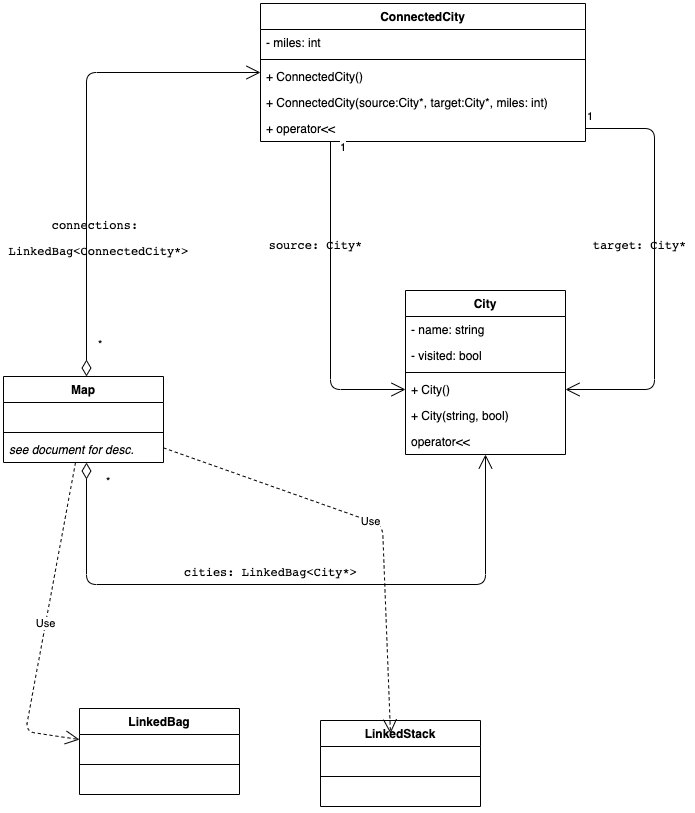

# Laboratory #3 - Backtracking

-----
**CSCI2421 - Summer 2021**

### **_Team Members Names:_**
- Student #1: `complete here`
- Student #2: `complete here`
- Student #3: ``

### **Lab Status**
```text
Describe briefly how complete your lab is, and how did you tested it.
Does it work on CSEGrid?
```

### **Discussion**
_What did you learn about backtracking?_
```text
Discuss your ideas with your partner an write a short summary here.
```

-----

## TODO:
1. Complete your and your teammates' names on the top of this document.
1. Open the **TODO tab** on CLION, and complete the implementation.
1. **Document your code**, as described on Canvas.
1. All team members should be working concurrently using **code-with-me on Clion**.
1. If you have questions, use Zoom _"Ask for help button"_ on the toolbar (bottom), and the instructors will get to
   your room asap. You can also use Slack concurrently.
1. **Please keep your camera turned on, so you can interact with your team.**
1. Instructors will be walking through the rooms regularly.
1. Push your solution to GitHub
1. Pull your solution from git into CSEGrid
1. Compile it and run it on CSEGrid using `make`.
1. **Capture a screenshot and save it on your CLion Project folder.**
1. Complete the *Lab Status* section on this document.
1. Complete Discussion.


### Submission
- Complete the lab.
- On CLion execute Build --> Clean from the menu (this will remove all temporary files)
- Using zip, compress the entire CLion Project and upload it to canvas before 11:59am.
- **LATE SUBMISSIONS**
    - The assignment will be open till 3pm. 
    - Submitting after 11:59:00am will imply a 20% penalty.
    - Submit your lab to your Lab 3 assignment on Canvas. 
    
- **Extra Credit**    
    - Extra credit is due 3pm, and it's totally optional for you.  
    - Submit the extra credit to the assessment "Lab 3 Extra Credit."
    - _The extra credit requires the implementation of the lab, and it will not be graded without
    the lab sumission_!


## Brief Description
The lab problem was adapted from the book example of Airline routes, to connected routes in the ground.
See the comments on the methods for details. 


